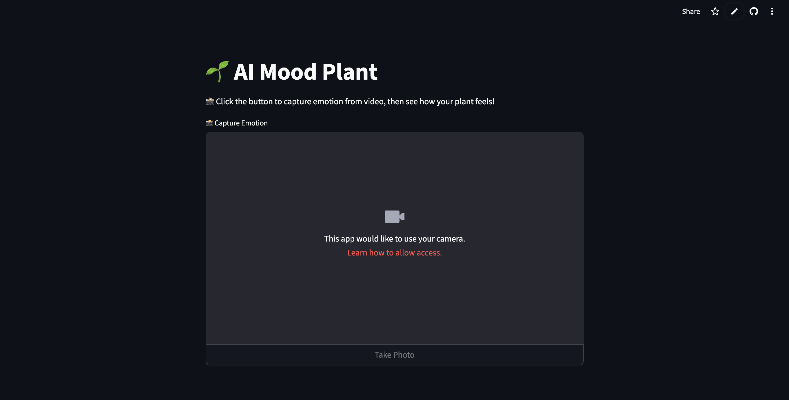

Here's your `README.md` for the **🌱 AI Mood Plant** project — following the same format and tone as your CLIP project:

---

# 🌱 AI Mood Plant — Emotion-Aware Interactive App

A playful and emotionally intelligent **plant companion** that reacts to your facial expression. Powered by facial emotion recognition and Streamlit UI — just click, capture, and watch the plant react in real time!

> ✅ Built with: `FER Transformer`, `Streamlit`, `PIL`, `PyTorch`, `Transformers`


---

## 🌿 Preview



---

## 🧠 Features

* 📸 Live camera input to **capture your emotion**
* 🧠 Classifies face into **Happy, Neutral, or Sad**
* 🌱 Displays a plant that **reflects your mood**
* 🪞 Real-time emotion detection with a simple UI
* 🎨 Clean and engaging layout for kids and adults

---

## 🚀 Getting Started

### 🔧 Prerequisites

* Python 3.9 or above (recommended)
* Webcam-enabled device

---

### 🖥️ Local Installation

```bash
# 1. Clone the repository
git clone https://github.com/rakshath66/play-with-plant.git
cd play-with-plant

# 2. (Optional) Create virtual environment
python -m venv venv
source venv/bin/activate  # On Windows use: venv\Scripts\activate

# 3. Install dependencies
pip install -r requirements.txt

# 4. Run the app
streamlit run app.py
```

---

## 🗂️ Project Structure

```
play-with-plant/
├── app.py                  # Main Streamlit app
├── plants/                 # Mood-based plant images (happy.jpg, sad.jpg, etc.)
├── images/                 # UI preview image (optional)
├── requirements.txt        # Python dependencies
├── README.md               # This file
```

---

## 📚 Technology Used

* 🤗 [ViT Face Expression Model](https://huggingface.co/trpakov/vit-face-expression)
* 🧠 Hugging Face Transformers
* 📷 Streamlit’s built-in camera input
* 🧮 PyTorch for inference
* 🖼️ PIL for image processing

---

## 🌈 Example Use Cases

* Kids' emotional awareness games
* Mood-based digital art or plants
* Emotional journaling apps
* Mental health awareness demos

---

## 🔐 No API Keys Needed

This app uses Hugging Face-hosted models **for free**.
If you hit limits, just run:

```bash
huggingface-cli login
```

---

## ⭐ Contribute

### 🛠 Steps to contribute:

1. Fork the repo
2. Create a branch: `git checkout -b my-feature`
3. Make changes and commit: `git commit -m "Add: feature"`
4. Push your branch: `git push origin my-feature`
5. Open a pull request ✅

> Clean and fun contributions welcome!

---

## 📃 License

MIT License © [Rakshath U Shetty](https://github.com/rakshath66)

---

## 🛣️ Roadmap

### ✅ Phase 1: Launch

* Core emotion-to-plant mapping
* Camera input + live mood detection
* Neutral → Happy → Sad mapping

### 🔜 Phase 2: Next Features

* 🎞️ Add GIF-style animation for plants
* 🧠 Mood journal with time logs
* 🌐 Share plant mood on social media
* 🗣️ Voice feedback based on emotion

---

### 👨‍💻 Built by [Rakshath U Shetty](https://www.linkedin.com/in/rakshathushetty/)

---

Let me know if you'd like badges for Streamlit Cloud or Hugging Face Spaces added!
